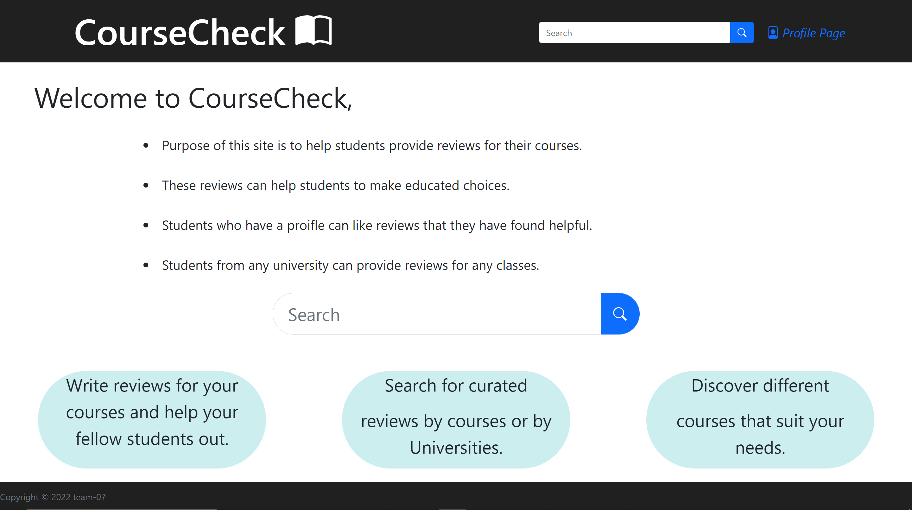
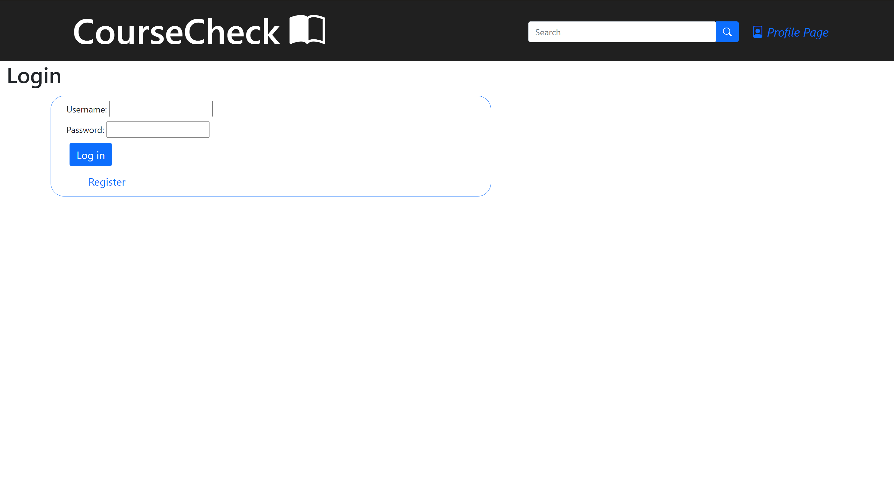
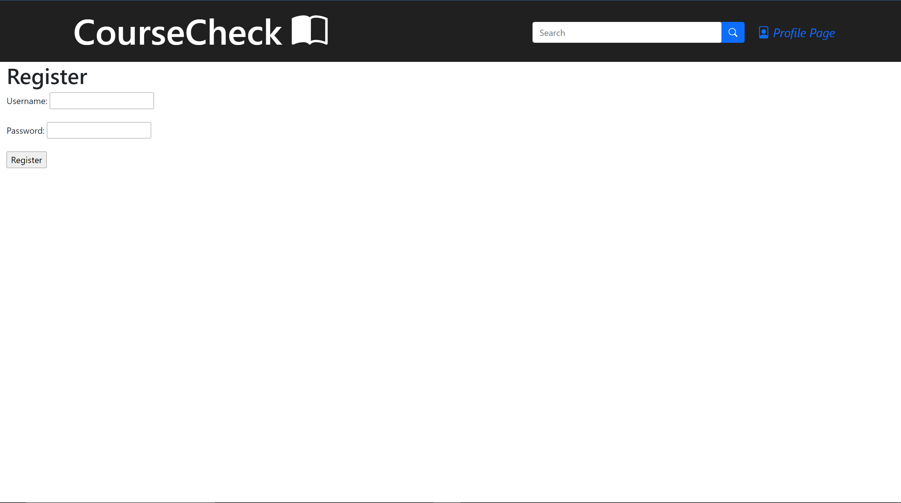
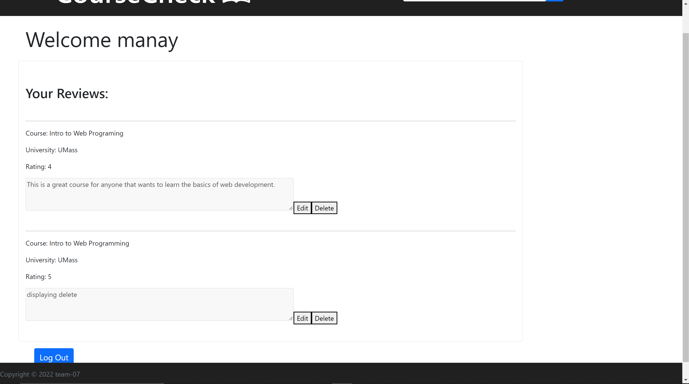
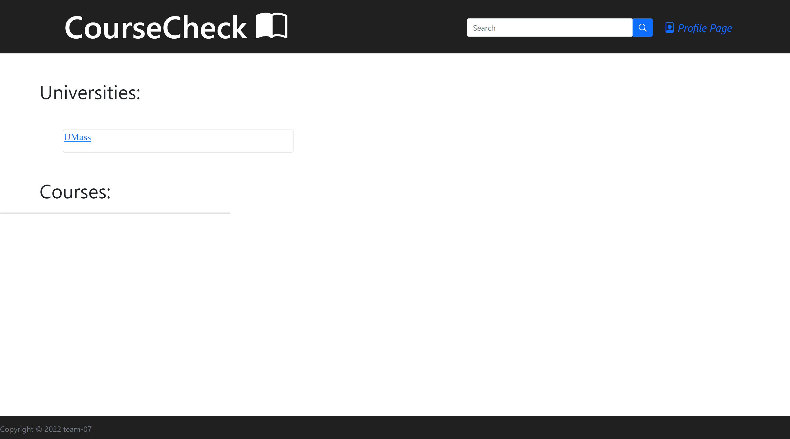
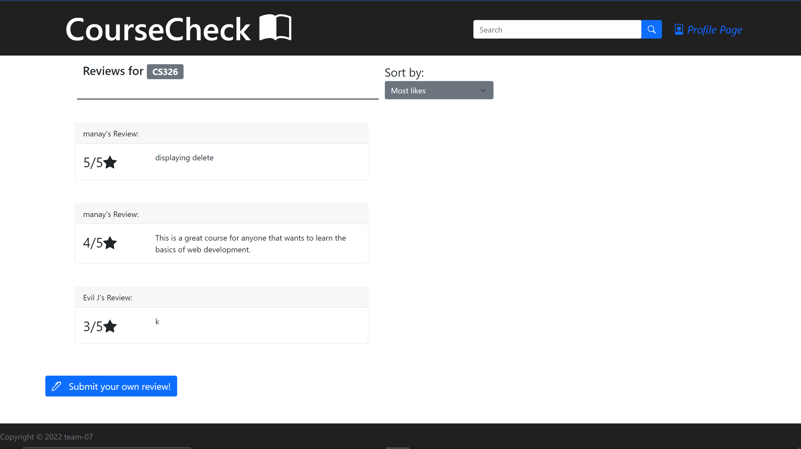
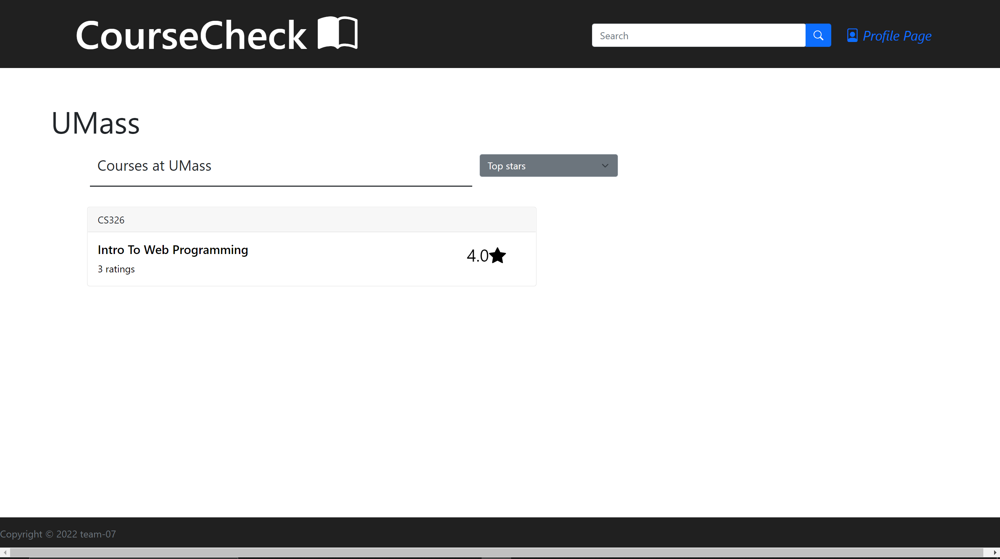
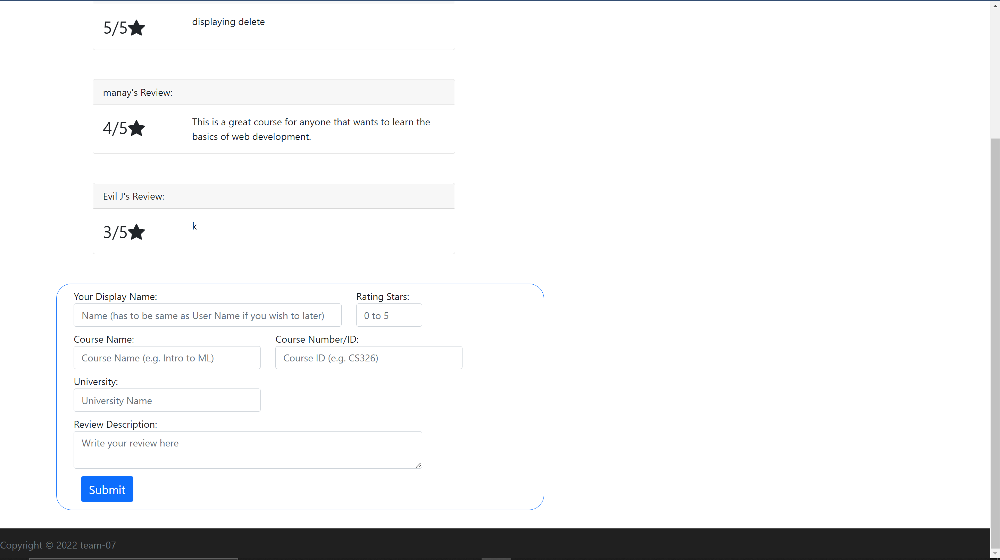

# Title:
### Team 7

# Subtitle:
### CourseCheck

# Application Link
### https://cs326-final-team7.herokuapp.com/Client/index.html

# Semester:
### Spring 2022

# Overview:

CourseCheck is a website for UMass students to rate and review their courses. The objective of the website is to collect and share data that will make it easier for UMass students to decide on which courses they would like to take. While websites exist to review specific professors or schools, there is no website in popular use to allow students to review specific courses. Our goal is to provide students with a straightforward and easily accessible method to learn about courses that they are considering.

# Team Members:

Andy Lu - 22alu  
Manay Patel - ManayPatel  
Muhammad Shah - muhammadshah27  
Jeffrey Wong - notjwong 

# User Interface

User Interface: A final up-to-date list/table describing your application’s user interface. This should include the name of the UI view and its purpose. You should include a screenshot of each of your UI views.
APIs: A final up-to-date list/table describing your application’s API

1. Home Page
    

2. Log In
    

3. Registration
    

4. User Profile
    

5. Search Results - All results of a search query
    
    
6. Course Search - Course Page that shows all reviews in that course
    

7. University Search - Uni Page that shows all courses in that uni
    

8. Create Review - Create your own review form
    

# APIs

1. courseRatings
    - GET
    - Parameters: courseID, uniName
    - Returns a list of all course ratings for a given course at the specified university.

2. uniList
    - GET
    - Parameters: query
    - Returns a list of all courses with at least one existing review at a specified university.

3. courseList
    - GET
    - Parameters: courseName
    - Returns all courses with names similar to the given course name.

4. userRatings
    - GET
    - Parameters: username
    - Returns all reviews made by the specified account.

5. updateUser
    - PUT
    - Parameters: username, newuser, email, password
    - Updates information associated with a specific account.

6. deleteReview
    - DELETE
    - Parameters: id
    - Deletes a given review.

7. updateReviews
    - PUT
    - Parameters: id, desc
    - Edits the content of a given review.

8. createReview
    - POST
    - Parameters: rating
    - Creates a review.

9.  uniRatings
    - GET
    - Parameters: uniname
    - All ratings under a uni

# Database

### Ratings Table
| Column       | Data Type | Description              |
|--------------|-----------|--------------------------|
| id           | integer   | id of the review created |
| userName     | String    | name of the creating user|
| description  | String    | description of the rating|
| rate         | integer   | number of stars out of 5 |
| uniName      | String    | Name of the uni of rating|
| courseName   | String    | Name of the course       |
| courseID     | String    | courseID string (eg CS326)|

### User Table
| Column       | Data Type | Description              |
|--------------|-----------|--------------------------|
| userName     | String    | User’s userName          |
| password 	   | String    | User’s Password          |

# URL Routes/Mappings

URL Routes/Mappings: A final up-to-date table of all the URL routes that your application supports and a short description of what those routes are used for. You should also indicate any authentication and permissions on those routes.

/ -> /index.html
Directs to main landing page.

/profilepage -> /Client/profilepage.html?user='', /Client/login.html
Directs to the user profile page if user is logged in; directs to login page otherwise.

/login -> /Client/login.html, /Client/profilepage.html?user=''
Directs to the login page if user is not logged in; directs to user profile page otherwise.

/logout -> /login.html
Upon successful logout, redirects to the login page.

/register -> /Client/register.html, /Client/login.html
Directs to user registration page if user is not logged in or registering; directs to login page upon successful registration.

# Authentication/Authorization

Authentication/Authorization: A final up-to-date description of how users are authenticated and any permissions for specific users (if any) that you used in your application. You should mention how they relate to which UI views are accessible.

Users may register an account through the registration page and be authenticated through the login process. Upon logging in, users will be able to edit reviews for courses they have made.

# Division of Labor

Division of Labor: A breakdown of the division of labor for each team member — that is, saying who did what, for the entire project. Remember that everyone is expected to contribute roughly equally to each phase of the project. We expect to see similar numbers and kinds of GitHub commits by each student.

### Manay Patel

### Andy Lu

### Muhammad Shah

### Jeffrey Wong

# Conclusion

Conclusion: A conclusion describing your team’s experience in working on this project. This should include what you learned through the design and implementation process, the difficulties you encountered, what your team would have liked to know before starting the project that would have helped you later, and any other technical hurdles that your team encountered.

# Rubric
