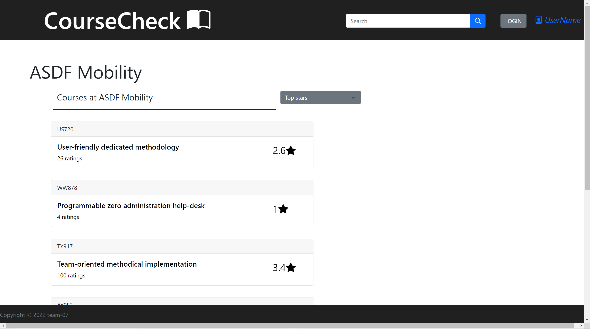

# APIs supported by the server:

1. courseRatings:
   -   Get
   -   Param: courseName & uniName
   -   Returns a list of all the course ratings for a given course and university name
   -   The returned object is a json file with required fields

2. uniRatings:
   - Get
   - Param: uniName
   - all courses that have a review under a University name

3. userRatings:
   - Get
   - Param: username
   - Returns list of all reviews made by a user

4. updateUser:
   - Put
   - Param: userName
   - Body: {
            username: xyz,
            newuser: abc,
            email: pqr,
            password: uvz
        }
   - Updates a user's info and sends status of whether the update was a success or a failure.

5. updateReviews:
   - Put
   - Param: userName
   - Body: review object
   - Updates the review and sends status of whether the update was a success or a failure.

6. unis:
   - Get
   - Param: query
   - Returns all matching university in database that match with the querry

7. courses:
   - Get
   - Param: courseName
   - Returns all matching courses in the database that match with the querry

8. userProfile:
   - Get
   - Param: userName
   - Returns the profile details of a user

9. createReview:
    - Post
    - Body: review object
    - Creates a new review in the database and sends status of whether the create was a success or a failure.

10. deleteReview:
    - DELETE
    - Param: userName
    - Body: review object
    - Deletes the specified review object under the userName and sends status of whether the delete was a success or a failure.

# CRUD Examples:

## Create:

We can see here that there is a submit form that we can use to create a new review which will send a request to the server to CREATE a new review entry in the database.

## Read:

This page is one of the examples of the READ process. On this page we can see that it sends the server a request using its url's parameters to get a list of all the courses that have a review at a university. The courses recieved have indvidual course numbers, course names, number of ratings, and overall rating of the course.

## Update:

In this image we can see that a user has options to edit a review made by that user. Editing a review and saving it sends a request to the server to update the review in the database. There is a similar option (that can be seen in the next screenshot) to update the user's profile which also updates a user's credentials in the database.

## Delete:

In this image we can see that a user has options to delete a review made by that user. Deleting a review sends a request to the server to delete that review in the database.

# Team Contribution:

Every member created the fetch calls they need in client.js and correspondingly created functions to support these requests in server.js.

### Andy Lu: 
Integreated functionalities for the profile page and added the corresponding apis in the server.js. Made Reading, Updating, and Deleting calls to the server to update the user's ratings.

#### Jeffrey Wong: 
Added api calls to uniSearchPage that requests data from server and displays on this page. Using url's parameter to request data from the server and displaying it to the page.

#### Manay Patel: 
Developed the submit form for a course review page and integrated api calls to read the reviews from the server and to create new review with the help of the form. Created file structure for the team to work on.

#### Muhammad Shah: 
Created api calls to when someone makes a search using the searchbar which redirects to a new page and lists out the results obtained from the server on the search querry.